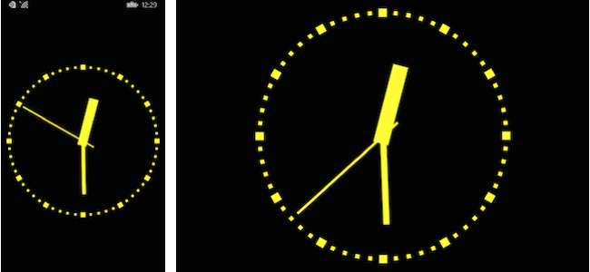

BoxViewClock (Windows)
======

Windows and Windows Phone versions for the [Windows PREVIEW](http://developer.xamarin.com/guides/cross-platform/xamarin-forms/windows/).

A classic analog clock realized entirely with *BoxView*. 

**If you open the solution in Xamarin Studio, it will not be able to load the Windows or Windows Phone projects;
and if you open the solution in Xamarin Studio under Windows, it will not be able to load the iOS project either.**

Xamarin.Forms doesn't yet have a vector graphics programming interface, but it does have a *BoxView*.
Although normally used for displaying rectangular blocks of color, *BoxView* can be sized, positioned, and 
rotated. This is enough to render a classic analog clock.

Author
------

Charles Petzold
