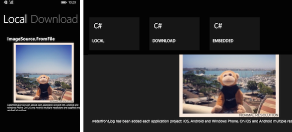
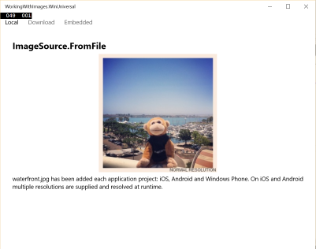

Working with Images (Windows)
==============

Windows and Windows Phone versions for the [Windows PREVIEW](http://developer.xamarin.com/guides/cross-platform/xamarin-forms/windows/).

And also UWP (Windows Universal):

These samples relate to the [Working with Images in Xamarin.Forms](http://developer.xamarin.com/guides/cross-platform/xamarin-forms/working-with/images) doc.

Author
------

Craig Dunn
